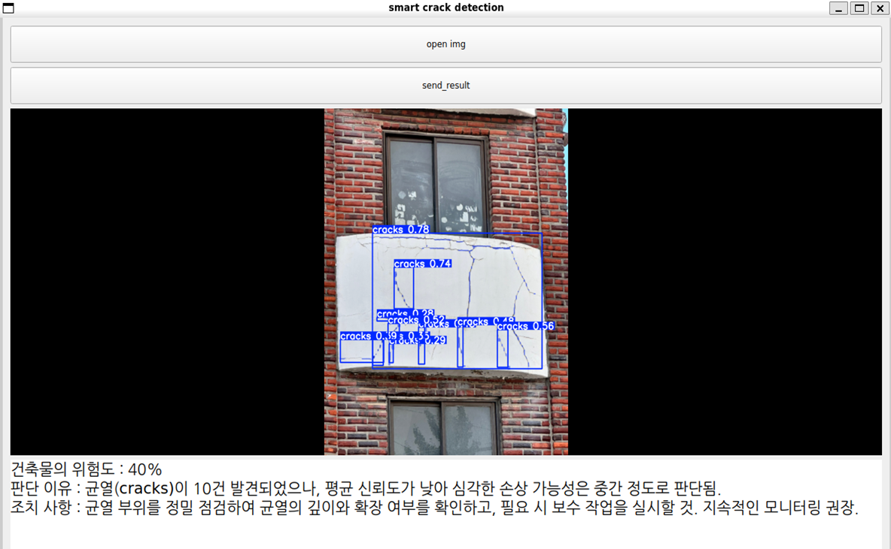
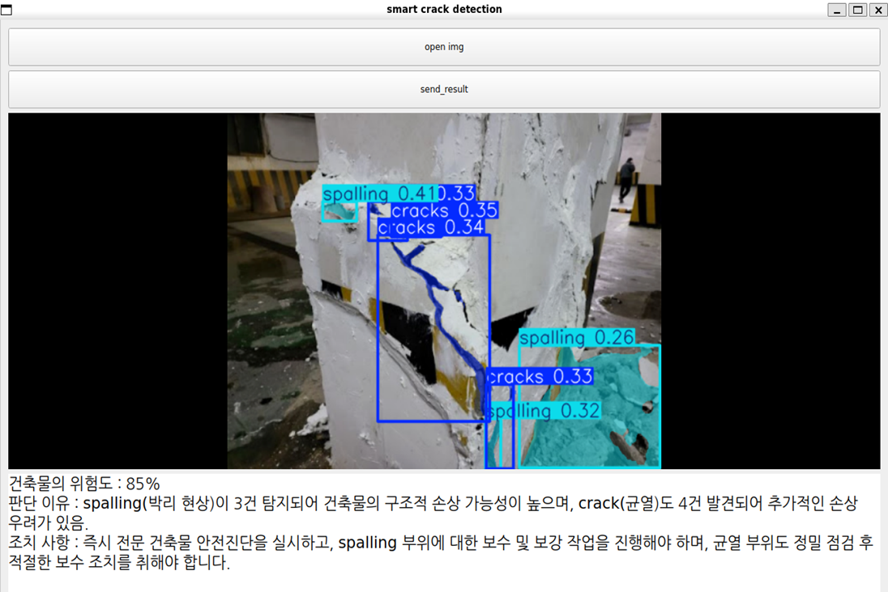

# smart_carck_detection
A YOLO-based application that predicts the risk of structural collapse in buildings using images.

<br>

# Requirements
- Python 3.12
- A `GPT-4.1 mini`-compatible environment
- A valid `OPENAI_API_KEY` set as an environment variable
- Recommended: `uv` for package management

<br>

# 📦 Installation & Setup
⚠️ Make sure the OPENAI_API_KEY is registered as an environment variable. This project uses GPT-4.1 mini.

⚠️ It is recommended to install packages using uv for faster and more reliable setup.


```
git clone https://github.com/gaeguli/smart_crack_detection.git
cd smart_crack_detection
uv sync --frozen
```

<br>

# Usage
```
uv run app.py
```

1. Click the `Open Img` to load a photo.
2. The trained YOLO model performs inference on the image.
3. Click the `Send Result` to submit predictions to ChatGPT for analysis and action suggestions.

<br>

# Preview


<br/>



<br/>

<br/>

